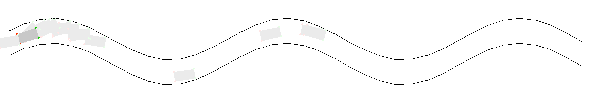

# Genetic self-driving cars in Python

## Objectives

The main objective of this project was to quickly produce viable models for self-driving cars, and also having fun by watching how simple mechanisms can evolve by mimicking nature.

## Building blocks

- [PyTorch](https://pytorch.org/) was used for creating the "intelligent" part of the cars: a very simple feed-forward neural network.
- [PyGame](https://www.pygame.org/news) was used for displaying the progress made by generations of cars

## How it's done

The basic object is a `Car`, being controlled by a `Driver`, which has access to a `Model` (or brain). The driver sees the distance from the car to a `Road` wall, and reacts accordingly, by changing the acceleration (forward or backward) and steering (left or right) of the vehicle.

A `God` generates a number of drivers, and lets them drive for a finite period of time or until a collision (with a wall). After all the drivers have finished their run, the god keeps the best ones (sorted by distance driven) and generates children for the next round by breeding two models together (and mutating them a few times).

Finally, a `Game` object handles the drawing of objects on the screen, since numbers only are not very pleasing to a human supervisor.

## Physics

The physics part of the project was established in a very empirical manner, by observing cars and modifying parameters until satisfaction. 

The most important parameters that define the interaction of a car with its environment are:

- `MAX_STEERING`: how much a car can turn
- `MAX_ACCELERATION`: how much a car can accelerate
- `MAX_SPEED`: how fast a car can move
- `SPEED_DAMPING`: how hard friction slows down a car with no inherent acceleration
- `TOLERANCE`: the distance constituting a collision between two points 

## How it's run

To run a simulation, simple run `python game.py`.

## Future improvements

1. The function to compute the distance from car to wall leaves much to be desired and should definitely be optimized.
2. In conjunction with the first point, roads would be more interesting if not algorithmically generated. Recovering the pixels from a binary image would allow for more flexibility.
3. I'm still not sure how to properly breed two neural networks together (particularly when number of layers and layers dimensions are different)...

## Inspiration

[This video](https://www.youtube.com/watch?v=Aut32pR5PQA) was very inspirational for this project.
